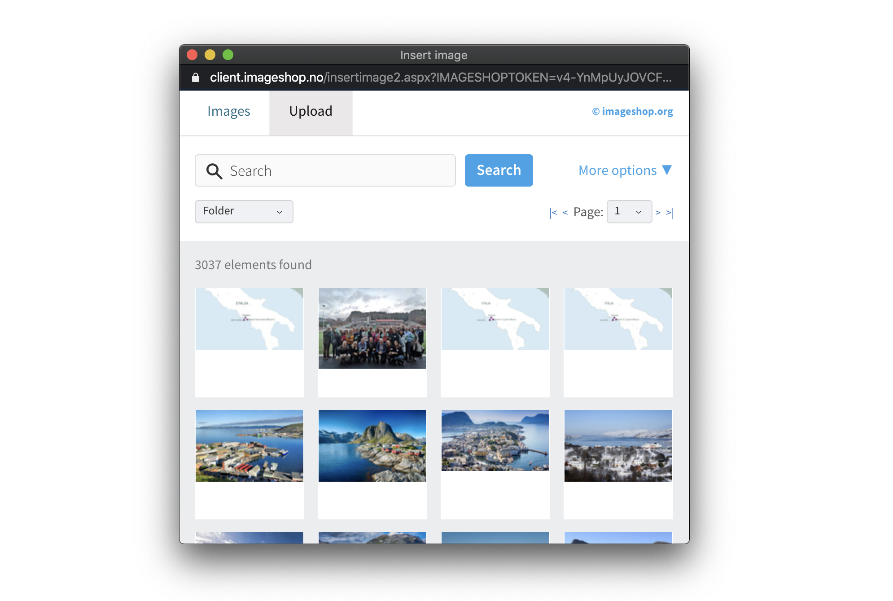

# Imageshop Field for Craft CMS

This plugin uses Imageshop's image selector (in a popup) and saves the result as a field for
developers to pull out in templates, it includes a simple preview of the selected image, 
works well with [Imager](https://github.com/aelvan/Imager-Craft), check the example section 
for information on how to use this plugin..
 
 
 
#
# Installation

To install the plugin, follow these instructions.

1. Open your terminal and go to your Craft project:

```` 
cd /path/to/project
````

2. Then tell Composer to load the plugin:

```
composer require guilty/craft-imageshop-field
```
        
3. In the Control Panel, go to Settings → Plugins and click the “Install” button for 'Imageshop'.

OR do it via the command line

```
php craft install/plugin craft-imageshop-field
```
         

4. You will now have "Imageshop selector" available as a choice in the Field type dropdown on the field creation page.

 
  
## Templating:

### Using Imager

```twig
<h2>Image Single</h2>



```
 
 
### Available variables

```imageshopField``` is the name of the field in these examples.

 ```twig
Code:           {{ entry.imageshopField.code }}
Image:          {{ entry.imageshopField.image }}
Tags:           {{ entry.imageshopField.tags("no") | join(", ") }}
Title:          {{ entry.imageshopField.title }}
Rights:         {{ entry.imageshopField.rights }}
Description:    {{ entry.imageshopField.description }}
Credit:         {{ entry.imageshopField.credits }}
DocumentId:     {{ entry.imageshopField.documentId }}
Raw:            {{ entry.imageshopField.json | json_encode(constant("JSON_PRETTY_PRINT")) }}
```


